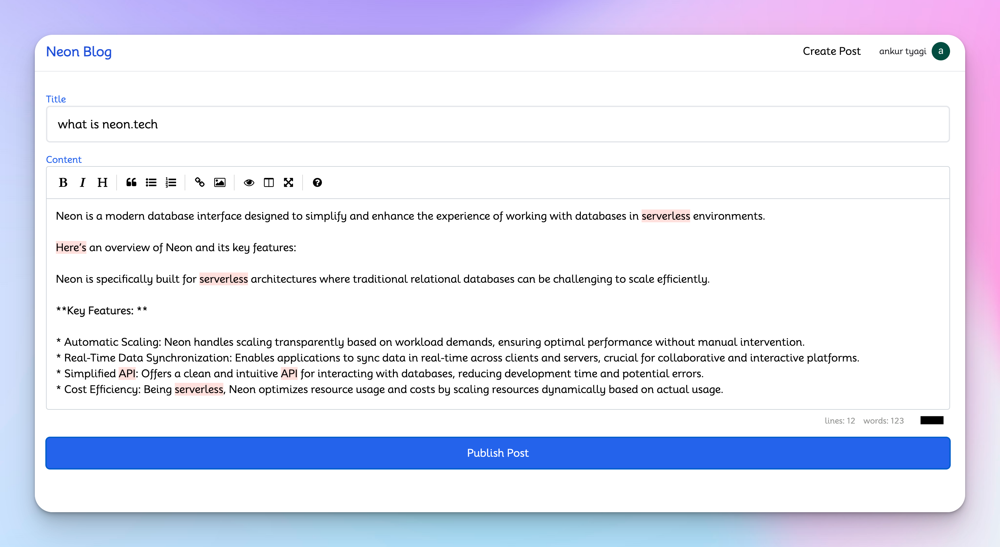

# Serverless Postgres Next.js Handbook



Welcome to the Serverless Postgres Next.js Handbook. Follow these steps to get started:

## Table of Contents
- [Introduction](#introduction)
- [Getting Started](#getting-started)
- [Next Steps](#next-steps)
- [Get Started with Neon Today](#get-started-with-neon-today)

## Introduction

[Neon](https://neon.tech) is a serverless Postgres platform designed to help you build reliable and scalable applications faster. We separate compute and storage to offer modern developer features such as autoscaling, branching, point-in-time restore, and more. Get started today with our generous free tier.

## Getting Started

1. **Clone the repository:**
   ```bash
   git clone https://github.com/tyaga001/serverless-postgres-nextjs-handbook.git

2. Install the project dependencies.
  ```bash
  npm install
  ```
3. Create your .env.local file:

Create a .env.local file in the root directory of the project.

 ```bash
  touch .env.local
  ```

4. Set up Neon database:

Create a [Neon project](https://neon.tech/docs/introduction) and copy your connection string into the `.env.local` file.
  ```bash
  NEON_DATABASE_URL=
  ```

5. Set up Clerk application:

Create a [Clerk application project](https://clerk.com) and copy your credentials into the `.env.local` file.
  ```bash
   NEXT_PUBLIC_CLERK_PUBLISHABLE_KEY=
   CLERK_SECRET_KEY=
  ```
6. Initialize the database:

Execute the command - `npm run db-create` within your terminal.
  
7. Start the Next.js development server:
  ```bash
  npm run dev
  ```
8. Open the application in your browser:

Navigate to http://localhost:3000 to view the app.

## Next Steps

- Explore [Neon's documentation](https://neon.tech/docs) for advanced features and API references.
- Learn more about [Clerk](https://clerk.com) for user authentication and management.
- Check out the [Next.js documentation](https://nextjs.org/docs) for optimizing your application performance.

## Next Steps with Neon

1. **Explore Neon Docs:**
   - Dive into [Neon's documentation](https://neon.tech/docs) for comprehensive guides and API references.

2. **Discover Best Practices:**
   - Learn best practices for optimizing db performance with Neon's [guides](https://neon.tech/guides).

3. **Stay Updated:**
   - Read about the latest features and updates on the Neon [blog](https://neon.tech/blog).

4. **See Case Studies:**
   - Explore how companies are using Neon in real-world scenarios on [case studies](https://neon.tech/case-studies) page.

5. **Enterprise Solutions:**
   - Learn how Neon can support enterprise needs on [enterprise](https://neon.tech/enterprise) page.

6. **Branching Strategies:**
   - Discover effective branching strategies with Neon on [branching](https://neon.tech/branching) page.

7. **Join the Neon Community:**
   - Engage with the Neon community on [discord](https://neon.tech/discord) and stay updated with the latest developments.

---

### Get Started with Neon Today

Learn more about Neon's features at [Neon.tech](https://neon.tech).

---

